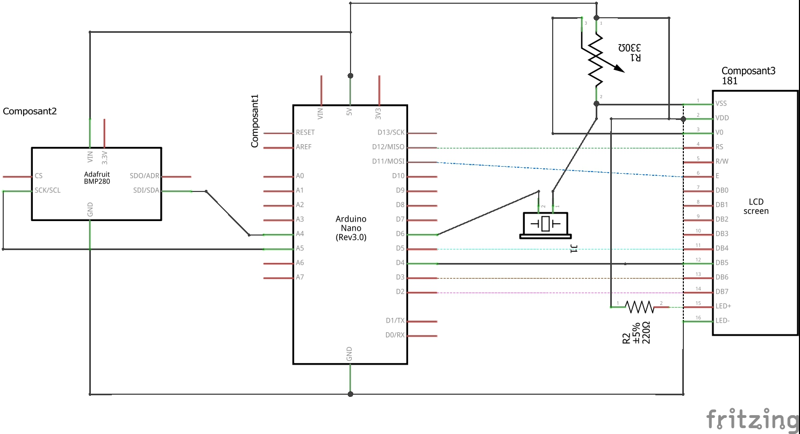
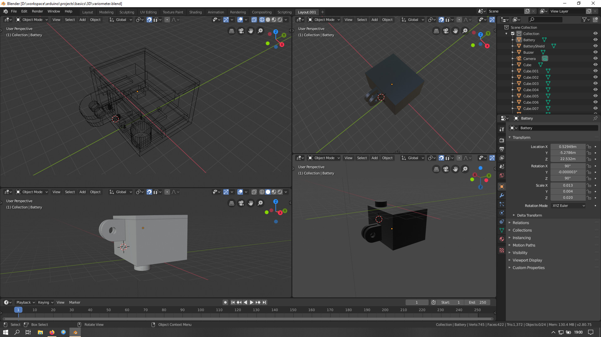

# Arduino variometer

Mini Paragliding variometer based on Arduino technology.

Aim of this project is to have the smallest and cheapest paragliding variometer.
Mechanical fixation will be realized using action cam standard allowing tones of fixing possibilityes.

## Component and prices

* Arduino Nano Atmega328 *[4.33€]*
* Piezo Buzzer passive *[2.49€]*
* BMP280 sensor *[2.66€]*
* Batterie Shield *[3.49€]*
* Battery *[12.23€]*
* Switch On/Off *[0.28€]*

Total Price **25.48€**

Debug only components
* LCD 16*2 *[3.18€]*
* Breadboard and cables *[8€]*

# Software environnment

* arduino-1.8.13 IDE
* Visual code 1.53
    * vsciot-vscode.vscode-arduino
    * ms-vscode.cpptools
* blender 2.80
* fritzing.0.8.7b.pc
* fritzing library https://github.com/adafruit/Fritzing-Library

# Debug mode and callibration mode

Software allows 2 debug and callibration modes

## Serial mode

Using USB serial console to print information. Buzzers are disabled quiet mode.

## Display mode

Using arduino LCD to display information
Temperature and vertical speed in m/s.
Up or down movement detection.

# Electronic

**Debug Breadboard**

**Debug Schematic**

**Debug Picture**

# Mechanic

